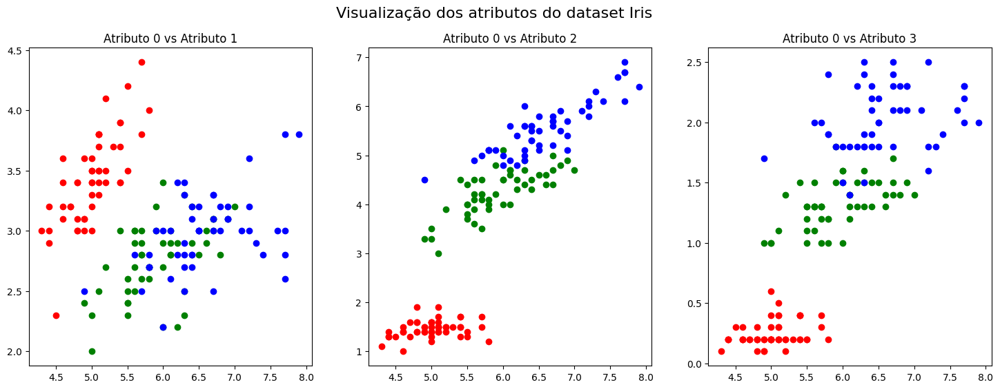

# Aula 1

## **1 - Aspectos Básicos:**

**Ciência de dados** é fundamentado em extrair informações (_insights_) significativos para os negócios, por meio da combinação de princípios e práticas vindas da matemática, estatística e inteligência artificial (aprendizado de máquina, redes neurais e outras técnicas).

A ideia é responder certos questionamentos contidos nos dados adquiridos que são de difícil concepção para tomadas de decisão.

**Principais pilares:**

* Análise descritiva: análise aprofundada dos dados por meio de visualizações, gráficos e tabelas;
* Análise diagnóstica: análise aprofundada para entendimento de fatos descrito nos dados, compreendendo técnicas como mineração de dados e correlações;
* Análise preditiva: utiliza o padrão dos dados para fazer previsões que podem ocorrer no futuro;
* Análise prescritiva: além de fazer previsões também sugere planos de ação para a resposta obtida.

**Onde se aplica?**

* Problemas para os quais as soluções atuais exigem muitos ajustes finos ou extensas listas de regras: um algoritmo de ciência de dados geralmente simplifica e tem um desempenho melhor do que a abordagem tradicional;
* Problemas complexos para os quais não existe uma boa solução quando utilizamos uma abordagem tradicional: talvez as melhores técnicas de ciências de dados encontrem uma solução;
* Adaptabilidade de ambientes: um sistema desenvolvido para ciência de dados pode se adaptar a novos dados;
* Entendimento de problemas complexos e grandes quantidades de dados.

## **1.1 - Aprendizado de Máquina:**

**Aprendizado de máquina** são técnicas baseadas em experimentos, em que o processo de decisão para solucionar um problema é direcionado pelo conhecimento adquirido durante sucessivas etapas de aprendizagem.

Qualquer método que incorpora informação a partir de exemplos de treinamento emprega aprendizado.

**Aprendizado** se refere a alguma forma de algoritmo que reduza o erro no conjunto de treinamento.

**Formalmente:** É dito que um programa de computador aprende a partir de uma **experiência $E$** em relação a uma classe de **tarefas $T$** e **métrica de performance $P$**, se sua performance na tarefa $T$, medido por $P$, melhora com a experiência $E$.

**Alguns termos relacionados ao aprendizado:**

* Instâncias ou exemplos;
* Características ou atributos;
* Espaço de características;
* Conjuntos de treinamento e de testes;
* Tarefas de aprendizado (aprendizado supervisionado e não supervisionado);
* Métricas de avaliação (performance).

```python
# Importação de bibliotecas
import numpy as np
from sklearn.datasets import load_iris

# Carregando o dataset Iris
iris = load_iris()
X = iris.data              # Atributos (características das flores)
y = iris.target            # Rótulos (espécies de flores)

# Informações básicas do conjunto
print("Rótulos (espécies):", y)
print("Formato dos dados (amostras, atributos):", X.shape)
print("Formato dos rótulos:", y.shape)
print("Classes disponíveis:", np.unique(y))

# Exemplo de uma instância
print("\nPrimeira amostra:", X[0])
print("Rótulo da primeira amostra:", y[0])

# Visualização das primeiras amostras
print("\nPrimeiras 5 linhas do espaço de características:")
print(X[:5, :])
```

```
Rótulos (espécies): [0 0 0 0 0 0 0 0 0 0 0 0 0 0 0 0 0 0 0 0 0 0 0 0 0 0 0 0 0 0 0 0 0 0 0 0 0
 0 0 0 0 0 0 0 0 0 0 0 0 0 1 1 1 1 1 1 1 1 1 1 1 1 1 1 1 1 1 1 1 1 1 1 1 1
 1 1 1 1 1 1 1 1 1 1 1 1 1 1 1 1 1 1 1 1 1 1 1 1 1 1 2 2 2 2 2 2 2 2 2 2 2
 2 2 2 2 2 2 2 2 2 2 2 2 2 2 2 2 2 2 2 2 2 2 2 2 2 2 2 2 2 2 2 2 2 2 2 2 2
 2 2]
 
Formato dos dados (amostras, atributos): (150, 4)
Formato dos rótulos: (150,)
Classes disponíveis: [0 1 2]

Primeira amostra: [5.1 3.5 1.4 0.2]
Rótulo da primeira amostra: 0

Primeiras 5 linhas do espaço de características:
[[5.1 3.5 1.4 0.2]
 [4.9 3.  1.4 0.2]
 [4.7 3.2 1.3 0.2]
 [4.6 3.1 1.5 0.2]
 [5.  3.6 1.4 0.2]]
```

```python
# importação da função para dividir os dados em treino e teste
from sklearn.model_selection import train_test_split

# Divisão em conjunto de treino e teste
X_train, X_test, y_train, y_test = train_test_split(
    X, y, test_size=0.2, shuffle=True, random_state=42
)

# Informações sobre os conjuntos de treino e teste
print("\nDados de treino - X:", X_train.shape, " y:", y_train.shape)
print("Dados de teste  - X:", X_test.shape, " y:", y_test.shape)

```

```
Dados de treino - X: (120, 4)  y: (120,)
Dados de teste  - X: (30, 4)  y: (30,)
```

**O espaço de características de treinamento deve ser:**

* Formado a partir de descritores (cores, textura, valores nominais, entre outros);
* Completamente discriminativo, ou seja, cada atributo deve fornecer informação que auxilie na distinção das instâncias;
* Pré-processados (remoção de outliers, redução do espaço, normalização, entre outros).

```python
# importação de bibliotecas para visualização
import matplotlib.pyplot as plt

# Visualização dos atributos em gráficos de dispersão
plt.figure(figsize=(18, 6))
colors = ['red', 'green', 'blue']

# Gráfico 1: atributo 0 vs atributo 1
plt.subplot(1, 3, 1)
plt.title("Atributo 0 vs Atributo 1")
for i in range(len(X)):
    plt.scatter(X[i, 0], X[i, 1], color=colors[y[i]])

# Gráfico 2: atributo 0 vs atributo 2
plt.subplot(1, 3, 2)
plt.title("Atributo 0 vs Atributo 2")
for i in range(len(X)):
    plt.scatter(X[i, 0], X[i, 2], color=colors[y[i]])

# Gráfico 3: atributo 0 vs atributo 3
plt.subplot(1, 3, 3)
plt.title("Atributo 0 vs Atributo 3")
for i in range(len(X)):
    plt.scatter(X[i, 0], X[i, 3], color=colors[y[i]])

plt.suptitle("Visualização dos atributos do dataset Iris", fontsize=16)
plt.show()
```

<figure><figcaption><p>Figura 1 - Visualização dos atributos</p></figcaption></figure>

Cada um dos atributos pode ser quantitativo ou qualitativo:

* **Quantitativos:** são representatos por valores numéricos discretos. Exemplos: peso, altura, quantidade de patas, preço, etc.
* **Qualitativos:** representam níveis ou escala de valores. Exemplos: nível de escolaridade, fabricante de um determinado produto, etc.

Os atributos qualitativos requerem sua transformação para valores quantitativos _(Vamos ter uma aula posteriormente somente sobre tratamento de dados)_.

***

**Como obter um espaço de características para um conjunto de instâncias?**

* Imagens?
* Mercado de ações?
* Diagnóstico de uma doença?

**Como avaliar e melhorar o espaço de características para um conjunto de instâncias?**

## **2 - Uma ideia mais formal do aprendizado supervisionado:**

No aprendizado supervisionado, nós temos conhecimento dos rótulos de cada instância existente:

$X = \[x\_1, x\_2, ..., x\_n] \~ ϵ \~ \mathbb{R}^n$

$Y = \{{y\_1, y\_2, ..., y\_m\}}, m >= 2$

* $X$ é o espaço de características formado por $n$ atributos distintos;
* $Y$ é conjunto de rótulos formado por $m$ categorias distintas;
* Cada instância $x$ possui $n$ valores e um $y\_k$ associado.

Assim, no aprendizado supervisionado, queremos encontrar uma função $f()$ que consiga mapear $x$ em uma saída $y$, ou seja, $y = f(x)$.

$$y_i = f(X_i, \theta) + \epsilon_i$$

* $\theta$: representa o conjunto de parâmetros a serem aprendidos (são alterados conforme o aprendizado);
* $\epsilon\_i$: representa o erro alcançado à instância $i$

## **2.1- Classificação:**

Dado um conjunto de observações $D = \{{X, Y\}}$, temos uma função $f()$ que mapeia uma entrada $x\_i$ (atributos) à sua respectiva saída $y\_i$. Assim, $f(x)$ aprende a aproximação que permite estimar $y$ (classes pré-definidas) para os valores de $x$.

* A função $f()$ é um classificador que fornece probabilidades (score) dos dados de entrada nas possíveis saídas (classes);
* $y$ será um valor inteiro pertencente à $Y$;
* A métrica mais utilizada é a acurácia (taxa de acerto);
* Exemplos: {benigno, maligno}, {cachorro, gato}, {bom pagador, mal pagador}.

**Em tarefas de classificação queremos predizer variáveis qualitativas.**

```python
# Importação das bibliotecas necessárias
import numpy as np
from sklearn.datasets import load_iris
from sklearn.model_selection import train_test_split
from sklearn.neighbors import KNeighborsClassifier
from sklearn.naive_bayes import GaussianNB

# Carregando o dataset Iris
iris = load_iris()
X = iris.data              # Atributos (características das flores)
y = iris.target            # Rótulos (espécies de flores)

# Informações básicas do conjunto de dados
print("Formato dos dados (amostras, atributos):", X.shape)
print("Formato dos rótulos:", y.shape)
print("Classes disponíveis:", np.unique(y))

# Divisão dos dados em treino e teste
X_train, X_test, y_train, y_test = train_test_split(
    X, y, test_size=0.2, shuffle=True, random_state=42
)

# Exibindo os primeiros rótulos esperados
print("\nRótulos reais (esperados):", y_test[:10])

# ===========================
# Modelo 1: K-Vizinhos mais próximos (KNN)
# ===========================
knn = KNeighborsClassifier(n_neighbors=1)               # Criando o modelo com K=1
knn.fit(X_train, y_train)                               # Treinando o modelo
pred_knn = knn.predict(X_test)                          # Realizando predições
print("Predição com KNN (k=1):       ", pred_knn[:10])  # Mostrando os 10 primeiros resultados

# ===========================
# Modelo 2: Naive Bayes Gaussiano
# ===========================
gnb = GaussianNB()                                      # Criando o modelo
gnb.fit(X_train, y_train)                               # Treinando o modelo
pred_gnb = gnb.predict(X_test)                          # Realizando predições
print("Predição com Naive Bayes:     ", pred_gnb[:10])  # Mostrando os 10 primeiros resultados

```

```
Formato dos dados (amostras, atributos): (150, 4)
Formato dos rótulos: (150,)
Classes disponíveis: [0 1 2]

Rótulos reais (esperados): [1 0 2 1 1 0 1 2 1 1]
Predição com KNN (k=1):        [1 0 2 1 1 0 1 2 1 1]
Predição com Naive Bayes:      [1 0 2 1 1 0 1 2 1 1]
```

**Principais classificadores:**

* K-NN
* Árvores de Decisão
* Naive-Bayes
* Máquina de Vetor de Suporte
* Redes Neurais

**Tipos de classificadores:**

* Binária:
  * Cada instância pode ser classificada somente em uma das duas classes sem sobreposição;
  * Maioria das técnicas são desenvolvidas para este cenário;
  * Exemplo: {maligno, benigno}
* Classes múltiplas:
  * Cada instância pode ser classificada somente em uma das $k$ classes sem sobreposição;
  * Maioria das técnicas são generalizações do modelo binário ou combinações $2$ a $2$;
  * Exemplo: {mamíferos, aves, répteis, anfíbios, peixes}
* Multi-rótulos:
  * Cada instância pode ser classificada em $j$ classes das $k$ classes sem sobreposições;
  * Exemplo: {mamíferos, aves, répteis, anfíbios, peixes}, porém, em uma imagem há um mamífero e uma ave presentes;
* Hierárquica:
  * Cada instância pode ser classificada somente em uma das $k$ classes sem sobreposição, contudo, cada classe há subdivisões;
  * Exemplo: {veículos, eletrodomésticos}, sendo que veículos contém subclasses {automóveis, ônibus, motocicletas};

## **2.2 - Regressão:**

Dado um conjunto de observações $D = \{{X, Y\}}$, temos uma função $f()$ que mapeia uma entrada $X\_i$ (conjunto de atributos) à sua respectiva saída $y\_i$. Assim, $f(x)$ aprende a aproximação que permite estimar $y$ (valores continuos) para os valores de $x$.

* A função $f()$ é um regressor;
* $y$ será um valor real;
* Exemplos: peso, temperatura, demanda.

**Em tarefas de regressão queremos predizer variáveis quantitativas.**

```python
# Importação de bibliotecas
import numpy as np
import matplotlib.pyplot as plt
from sklearn import datasets
from sklearn.linear_model import LinearRegression
from sklearn.metrics import mean_squared_error, r2_score

# Carregando o dataset de diabetes
X, y = datasets.load_diabetes(return_X_y=True)

# Selecionando apenas a terceira variável (índice 2) como preditora
X = X[:, np.newaxis, 2]

# Separando os últimos 20 exemplos para teste
X_train, X_test = X[:-20], X[-20:]
y_train, y_test = y[:-20], y[-20:]

# Informações básicas sobre o conjunto de dados
print("Formato total dos dados:", X.shape)
print("Formato total dos rótulos:", y.shape)
print("Tamanho do conjunto de treinamento:", len(X_train))
print("Tamanho do conjunto de teste:", len(X_test))

# Criando e treinando o modelo de regressão linear
model = LinearRegression()
y_pred = model.fit(X_train, y_train).predict(X_test)

# Exibindo os primeiros valores esperados e preditos
print("\nValores reais (esperados):", y_test[:5])
print("Valores preditos:", y_pred[:5])

# Visualização dos resultados
plt.scatter(X_test, y_test, color="black", label="Dados reais")
plt.plot(X_test, y_pred, color="blue", linewidth=3, label="Regressão linear")
plt.title("Regressão Linear - Diabetes (1 variável)")
plt.xlabel("Valor da variável 2 normalizada")
plt.ylabel("Progresso da doença")
plt.legend()
plt.show()
```

```
Formato total dos dados: (442, 1)
Formato total dos rótulos: (442,)
Tamanho do conjunto de treinamento: 422
Tamanho do conjunto de teste: 20

Valores reais (esperados): [233.  91. 111. 152. 120.]
Valores preditos: [225.9732401  115.74763374 163.27610621 114.73638965 120.80385422]
```

<figure><figcaption><p>Figura 2 - Visualização da saída do código</p></figcaption></figure>

## **3 - E o aprendizado não supervisionado?**

No aprendizado não supervisionado, nós **não** temos conhecimento dos rótulos de cada instância existente:

* É fundamentado na descoberta da estrutura das características, se ela de fato existir;
* O objetivo principal consiste em separar as instâncias de entrada em grupos, detectando quais características as tornam mais similares entre si.
* Durante este processo, chamado de _clustering_, o algoritmo busca identificar quais características são mais dominantes no conjunto de atributos.

**Exemplo** (agrupar imagens de veículos):

* Um atributo dominante no espaço de características pode ser a existência ou não de portas.
* Assim, imagens de motos podem ser agrupadas com bicicletas e imagens de aviões podem ser agrupadas com carros.

```python
# Importação de bibliotecas
import numpy as np
import matplotlib.pyplot as plt
from sklearn.cluster import KMeans
from sklearn.datasets import load_iris

# Carregando os dados do conjunto Iris
iris = load_iris()
X = iris.data

print("Formato do conjunto de dados Iris:", X.shape)

# Aplicando K-Means com diferentes números de clusters (usando apenas os dois primeiros atributos)
k2_labels = KMeans(n_clusters=2, random_state=42).fit_predict(X[:, [0, 1]])
k3_labels = KMeans(n_clusters=3, random_state=42).fit_predict(X[:, [0, 1]])
k4_labels = KMeans(n_clusters=4, random_state=42).fit_predict(X[:, [0, 1]])

# Visualizando os agrupamentos com diferentes valores de k
plt.figure(figsize=(18, 6))

plt.subplot(1, 3, 1)
plt.title("K-Means com k = 2")
plt.scatter(X[:, 0], X[:, 1], c=k2_labels, cmap='viridis')
plt.xlabel("Atributo 1 (comprimento da sépala)")
plt.ylabel("Atributo 2 (largura da sépala)")

plt.subplot(1, 3, 2)
plt.title("K-Means com k = 3")
plt.scatter(X[:, 0], X[:, 1], c=k3_labels, cmap='viridis')
plt.xlabel("Atributo 1 (comprimento da sépala)")
plt.ylabel("Atributo 2 (largura da sépala)")

plt.subplot(1, 3, 3)
plt.title("K-Means com k = 4")
plt.scatter(X[:, 0], X[:, 1], c=k4_labels, cmap='viridis')
plt.xlabel("Atributo 1 (comprimento da sépala)")
plt.ylabel("Atributo 2 (largura da sépala)")

plt.suptitle("Agrupamento com K-Means usando os dois primeiros atributos do Iris", fontsize=16)
plt.tight_layout()
plt.show()
```

```
Formato do conjunto de dados Iris: (150, 4)
```

<figure><figcaption><p>Figura 3 - Visualização dos resultados </p></figcaption></figure>

De forma geral, é muito difícil saber se um algoritmo não supervisionado está realmente aprendendo, pois não há um "professor" para avaliar suas predições.

**Principais Técnicas de Agrupamento:**

* K-Médias
* K-Medoids
* Fuzzy C-Means
* Agrupamento Hierárquico

## **4 - Generalização dos modelos preditivos:**

**Generalização** é a capacidade que um modelo possui de obter performances equivalentes considerando os conjuntos de treinamento e teste:

* Idealmente, espera-se que cada classe (na classificação; na regressão ter exemplos com valores altos e baixos) tenha uma quantidade alta de exemplos e que elas sejam praticamente equivalentes, ou seja, um **conjunto de treinamento balanceado**. Conjuntos desbalanceados tendem a ponderar a saída para a classe mais abundante, prejudicando a generalização do modelo.
* **Overfitting:** ocorre quando a função preditiva memoriza os dados de treinamento (geralmente, o modelo é muito complexo em relação à quantidade de dados).
* **Underfitting:** ocorre quando a função preditiva não consegue aprender os dados de treinamento (geralmente, o modelo é muito simples em relação à quantidade de dados).

<figure><figcaption><p>Figura 4 </p></figcaption></figure>

Quando observamos a Generalização de um modelo, **queremos que o erro alcançado com as instâncias de teste seja o menor possível**:

* Nem sempre modelos cada vez mais complexos irão nos proporcionar este objetivo;
* O erro de treinamento (linha azul) não é um bom parâmetro para se medir a generalização do modelo (linha vermelha para o conjunto de teste);
* A tendência é que o erro de treinamento se reduza com maior complexidade do modelo, desde que tenhamos dados suficientes;
* Se o erro de treinamento for praticamente zero, podemos interpretar que o modelo está com overfitting.

<figure><figcaption><p>Figura 5 -</p></figcaption></figure>

**Fontes de erro de modelos preditivos (viés-variância trade-off):**

* Viés (quanto maior o viés, mais simples é a hipótese induzida):
  * Incapacidade de um modelo aprender os dados;
  * Tendência a privilegiar uma ou mais hipóteses que atendam a um dado critério;
  * Ocorre quando o modelo é muito "simples" (pouco parâmetros), não captando a essência dos dados;
  * Associado ao underfitting;
* Variância (quanto maior a variância, mais complexa a hipótese induzida):
  * Sensibilidade do modelo ser usado com outros dados;
  * Quando o algoritmo presta atenção a detalhes sem importância nos dados;
  * Ocorre quando o modelo é muito "complexo" (muitos parâmetros);
  * Associada ao overfitting.
* Exemplo:
  * Suponha que o mundo possível de soluções seja o círculo azul; se não impusermos restrições, iremos verificar qual o melhor modelo dentre todos os possível (viés zero e variância máxima);
  * Ao colocarmos algumas restrições, círculo vermelho, reduzimos a quantidade de soluções a serem buscadas (aumentamos o viés, pois eliminamos soluções que poderiam ser ótimas; reduzimos a variância, pois temos menos soluções a validar);
  * Ao colocarmos restrições mais fortes, círculo verde, reduzimos ainda mais o espaço de busca para hipóteses válidas (aumentamos o viés cada vez mais e reduzimos a variância cada vez mais).

<figure><figcaption><p>Figura 6 - </p></figcaption></figure>

**Exemplo com Regressão:**

a) a função $g(x)$ possui os parâmetros fixos, sem treinamento, proporcionando alto viés e variância zero;

b) a função $g(x)$ continua com os parâmetros fixos, mas proporciona um melhor ajuste; o viés é menor que em (a) e a variância continua zero;

c) a função $g(x)$ é cúbica, se ajustando aos dados de treinamento; proporciona baixo viés e variância moderada;

d) a função $g(x)$ é linear que tenta que se ajustar aos dados de treinamento; proporciona viés e variância moderados.

<figure><figcaption><p>Figura 7 - </p></figcaption></figure>

Sempre podemos conseguir um erro de treinamento igual à zero selecionando um polinômio $p$ adequado, pois para qualquer conjunto de $n$ exemplos há um polinômio de grau $n - 1$ que interpola todos os exemplos.

**Consequentemente, estamos em busca do cenário ideal:**

Dado uma classe de modelos matemáticos, nós queremos encontrar o melhor modelo possível nesta classe. Isso requer algum tipo de busca eficiente ou procedimentos de otimização (processo de ajuste ou calibração da função):

<figure><figcaption><p>Figura 8 - </p></figcaption></figure>

## **5 - Como identificar o melhor modelo?**

Identificar qual a melhor abordagem para resolver um problema, em termos de complexidade e performance, é imprescindível dentre as muitas opções existentes na literatura. **Devido à grande quantidade de técnicas e combinações possíveis, avaliar e comparar os métodos empregados são de grande importância, tanto com o uso de métricas de performance, quanto em termos de complexidade.**

**Formas de avaliar um algoritmo de aprendizagem de máquina:**

* Desempenho preditivo (erro e acurácia);
* Custo (tempo de processamento e memória necessária);
* Interpretabilidade.

Fontes de variação entre os classificadores:

* **escolha do conjunto de teste:** diferentes conjuntos de teste podem proporcionar diferentes níveis de performance;
* **escolha do conjunto de treinamento:** definição do conjunto de treinamento pode representar diferentes aprendizados no algoritmo;
* **aleatoriedade interna do algoritmo de treinamento:** inicialização dos pesos nas redes neurais, por exemplo;
* **aleatoriedade do erro de classificação:** variações de resposta devido às regras descritas no algoritmo implementado.

Para que a **avaliação** e comparação entre modelos **seja justa**:

* pode-se variar valores de hiperparâmetros para cada modelo;
* todas as execuções devem conter os mesmos dados;
* os mesmos recursos computacionais devem estar disponíveis para todos os modelos;
* a mesma métrica de avaliação deve ser utilizada.

## **5.1 - No Free Lunch Theorem:**

* **Não existe um único classificador que possa ser considerado ótimo para todos os problemas**, ou seja, o desempenho elevado em uma classe de problemas é compensado com um mau desempenho em outras classes.
* Não há um princípio claro para se escolher um método ou um conjunto de métodos de aprendizagem, pois **raramente se tem um completo conhecimento da distribuição dos dados**; assim, a tarefa de encontrar um bom e único classificador que solucione um determinado problema é muito difícil.
* **Nenhum classificador ou método de aprendizado deve ser preferido em relação a outro**; a aparente superioridade de um algoritmo é devido à natureza do problema e da distribuição dos dados.

```python
# Importação de bibliotecas
import numpy as np
from sklearn.datasets import load_iris, load_wine
from sklearn.model_selection import KFold, cross_val_score
from sklearn.neighbors import KNeighborsClassifier
from sklearn.svm import SVC
from sklearn.naive_bayes import GaussianNB

# ===========================
# Carregamento dos conjuntos de dados
# ===========================

# Iris
iris = load_iris()
X_iris = iris.data
y_iris = iris.target
print("Conjunto de dados IRIS:", X_iris.shape)
print("Rótulos IRIS:", y_iris.shape)
print("Classes IRIS:", np.unique(y_iris))

# Wine
wine = load_wine()
X_wine = wine.data
y_wine = wine.target
print("\nConjunto de dados WINES:", X_wine.shape)
print("Rótulos WINES:", y_wine.shape)
print("Classes WINES:", np.unique(y_wine))

# ===========================
# Definindo o esquema de validação cruzada
# ===========================
num_folds = 5
kfold = KFold(n_splits=num_folds, shuffle=True, random_state=42)

# ===========================
# Definindo os classificadores
# ===========================
classifiers = {
    'K-NN (k=3)': KNeighborsClassifier(n_neighbors=3),
    'SVM (linear)': SVC(kernel='linear'),
    'Naive Bayes': GaussianNB()
}

# ===========================
# Avaliação nos dados do Iris
# ===========================
print("\nAvaliação no conjunto IRIS:")
for name, clf in classifiers.items():
    scores = cross_val_score(clf, X_iris, y_iris, cv=kfold)
    print(f"Acurácia com {name}: {scores.mean():.4f} +/- {scores.std():.4f}")

# ===========================
# Avaliação nos dados do Wine
# ===========================
print("\nAvaliação no conjunto WINES:")
for name, clf in classifiers.items():
    scores = cross_val_score(clf, X_wine, y_wine, cv=kfold)
    print(f"Acurácia com {name}: {scores.mean():.4f} +/- {scores.std():.4f}")
```

```
Conjunto de dados IRIS: (150, 4)
Rótulos IRIS: (150,)
Classes IRIS: [0 1 2]

Conjunto de dados WINES: (178, 13)
Rótulos WINES: (178,)
Classes WINES: [0 1 2]

Avaliação no conjunto IRIS:
Acurácia com K-NN (k=3): 0.9667 +/- 0.0211
Acurácia com SVM (linear): 0.9733 +/- 0.0249
Acurácia com Naive Bayes: 0.9600 +/- 0.0249

Avaliação no conjunto WINES:
Acurácia com K-NN (k=3): 0.7083 +/- 0.0903
Acurácia com SVM (linear): 0.9495 +/- 0.0368
Acurácia com Naive Bayes: 0.9830 +/- 0.0228
```

**Ugly Duckling:**

O mesmo conceito se aplica para a representação dos atributos de um conjunto de dados: técnicas de extração de características podem ser eficientes para um cenário e nem tanto para outros.

## **5.2 - Desempenho preditivo:**

**Hold-out:**

* Consiste em fazer um _split_ do conjunto de dados para treinamento e teste;
* Altamente dependente da sorte ou azar na definição dos conjuntos de treinamento e teste;
* Para reduzir a sorte ou azar, heurísticas buscam separar igualitariamente os dados entre as partições mantendo uma mesma distribuição.

<figure><figcaption><p>Figura 9 - </p></figcaption></figure>

```python
# Importação das bibliotecas necessárias
from sklearn.model_selection import train_test_split
from sklearn.metrics import accuracy_score
from sklearn.svm import SVC
from sklearn.datasets import load_iris

# Carregando o conjunto de dados Iris
iris = load_iris()
X = iris.data
y = iris.target

# Dividindo o conjunto de dados em treino e teste (50% para cada)
X_train, X_test, y_train, y_test = train_test_split(
    X, y, test_size=0.5, shuffle=True, random_state=42
)

# Criando e treinando o modelo SVM com kernel linear
svm_model = SVC(kernel='linear')
y_pred = svm_model.fit(X_train, y_train).predict(X_test)

# Avaliando a acurácia no conjunto de teste
accuracy = accuracy_score(y_test, y_pred)
print("Acurácia no hold-out com SVM (50% teste):", accuracy)

```

```
Acurácia no hold-out com SVM (50% teste): 1.0
```

**Cross-validation:**

* Consiste em dividir o conjunto de dados em $k$ grupos de mesmo tamanho $m$;
* O modelo deverá ser executado $m$ vezes, sempre deixando 1 dos $k$ grupos formados como conjunto de teste e os demais, alternadamente, como conjunto de treinamento;
* Uma vez formados os grupos, eles são fixos durante todo o experimento;
* Temos a possibilidade de incluir um destes grupos como conjunto de validação;
* Assim, a performance obtida ao final do experimento (média das performances obtidas) proporciona uma estimativa para a generalização do modelo.

<figure><figcaption><p>Figura 10 - </p></figcaption></figure>

```python
# Importação das bibliotecas necessárias
from sklearn.datasets import load_iris
from sklearn.model_selection import StratifiedKFold, cross_val_score
from sklearn.neighbors import KNeighborsClassifier

# Carregando o conjunto de dados Iris
iris = load_iris()
X = iris.data
y = iris.target

# Definindo a validação cruzada estratificada (preserva proporções das classes)
num_folds = 10
cv = StratifiedKFold(n_splits=num_folds, shuffle=True, random_state=42)

# Definindo o classificador K-Nearest Neighbors com k=3
knn = KNeighborsClassifier(n_neighbors=3)

# Avaliando o modelo com validação cruzada
scores = cross_val_score(knn, X, y, cv=cv)

# Exibindo os resultados
print(f"Acurácia média (Iris) com K-NN (k=3): {scores.mean():.4f} +/- {scores.std():.4f}")

```

```
Acurácia média (Iris) com K-NN (k=3): 0.9600 +/- 0.0533
```

**Jacknife** ou **leave-one-out**:

* $k$ folds, sendo que $k = m$, ou seja, cada grupo formado possui apenas 1 exemplo;
* alto custo computacional; entretanto, provê medidas de confiança e significância estatística para comparar dois modelos.

```python
# Importação das bibliotecas necessárias
from sklearn.datasets import load_iris
from sklearn.model_selection import KFold, cross_val_score
from sklearn.neighbors import KNeighborsClassifier

# Carregando o conjunto de dados Iris
iris = load_iris()
X = iris.data
y = iris.target

# Definindo o número de folds igual ao número de amostras (Leave-One-Out Cross-Validation)
num_folds = X.shape[0]
cv = KFold(n_splits=num_folds, shuffle=True, random_state=42)

# Definindo o classificador KNN com k=3
knn = KNeighborsClassifier(n_neighbors=3)

# Avaliando o modelo usando LOOCV
scores = cross_val_score(knn, X, y, cv=cv)

# Exibindo os resultados
print(f"Acurácia média (LOOCV) com K-NN (k=3): {scores.mean():.4f} +/- {scores.std():.4f}")

```

```
Acurácia média (LOOCV) com K-NN (k=3): 0.9600 +/- 0.1960
```

## **Resumo da aula:**

Introdução à Ciência de Dados:

* Aprendizado de Máquina;
* Instâncias ou exemplos;
* Características ou atributos;
* Espaço de características;
* Conjunto de dados;
* Principais tarefas.

Aprendizado supervisionado:

* Classificação;
* Regressão.

Aprendizado Não Supervisionado.

Generalização de modelos preditivos:

* Conceitos e balanceamento;
* _Overfitting_ e _underfitting_;
* Viés e variância;
* Teorema "No Free Lunch";
* Desempenho preditivo.

## **Considerações finais:**

* O **aprendizado supervisionado é direcionado pela existência de rótulos pré-definidos** que auxiliam na distinção de conceitos durante a absorção do conhecimento. Contudo, a rotulação é um processo custoso.
* O **aprendizado não supervisionado** busca aprender a estrutura dos dados para proporcionar agrupamentos em que estes dados são similares entre si.
* Encontrar o equilíbrio que proporcione o **modelo ideal entre viés e variância** é uma tarefa muito custosa, mas que deve ser buscada em prol da eficiência da tarefa executada.
* De forma geral e simplificada, o desenvolvimento do modelo de aprendizagem compreende a **aquisição e preparação dos dados, definição da tarefa a ser empregada, a escolha de uma medida de desempenho e a realização da experiência de treinamento**.
* **Nenhum método de reconhecimento de padrões é hierarquicamente superior a outro:** é o tipo de problema, distribuição dos dados e outras informações que irá determinar qual modelo deve prover a melhor performance; assim, devemos explorar diversas formas de quantificação para encontrar o ajuste ideal entre algoritmos de aprendizagem e o problema a ser resolvido.
* O Teorema **No Free Lunch** prega ceticismo a respeito de estudos que afirmam que um determinado método é superior a outros.
* Todo o potencial de um modelo está diretamente relacionado aos atributos dos exemplos: **pré-processamento e a escolha adequada de extratores de características tem grande influência na performance dos modelos**.
* Um estudo mais aprofundado da **distribuição dos dados** pode auxiliar na escolha do modelo preditivo.
* Na avaliação da performance, **os classificadores só podem ser comparados justamente** se o conjunto de treinamento, o conjunto de teste e a métrica de performance são exatamente os mesmos.

## **Bibliografia básica:**

* Hastie, Tibshirani e Friedman. The Elements of Statistical
  \
  Learning: Data Mining, Inference, and Prediction, Springer, 2002 (Capítulos 2 e 7).
* Duda, Hart e Stork, Pattern Classification, Wiley, 2nd. Edition, 2001 (Capítulos 1 e 9).
* Kroese, Botev, Taimre, Vaisman. Data Science and Machine Learning: Mathematical and Statistical Methods, 2019 (Capítulo 2).
* Mitchell. Machine Learning, McGraw-Hill Science, 1997 (Capítulos 1 e 2).
* Géron. Mãos à Obra: Aprendizado de Máquina com Scikit-learn, Keras & TensorFlow, 2021 (Capítulo 1).

## **Leituras complementares:**

* Sen, Hajra, Ghosh. **Supervised classification algorithms in machine learning: A survey and review**, 2020.
* Das, Behera. **A survey on machine learning: concept, algorithms and applications**, 2017.
* Zhang, Yu, Jiao, Xing, El Ghaoui, Jordan. **Theoretically principled trade-off between robustness and accuracy**, 2019.
* Belkin, Hsu, Ma, Mandal. **Reconciling modern machine-learning practice and the classical bias-variance trade-off**, 2019.
* Wu, Zhu, Deng, Zhang, Hou. **A mathematical foundation for robust machine learning based on bias-variance trade-off**, 2021.
